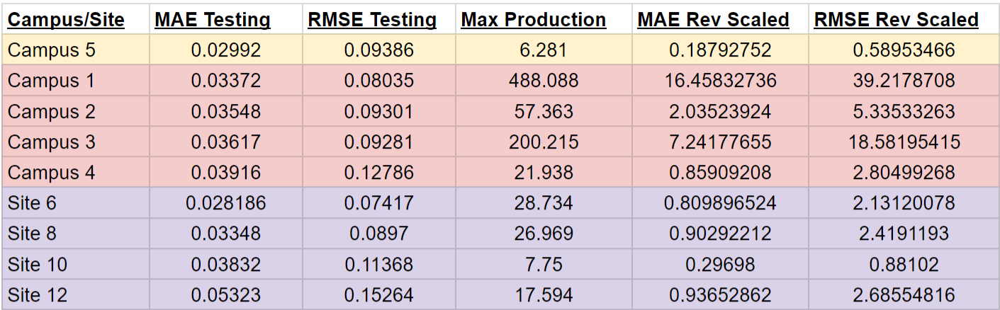

# Solar Energy Generation Prediction

## Table of Contents
* data
  * cleaned
  * raw
* images
  * images
  * visuals
* presentation
  * slides
* code
  * 00_collect_data
    * landcover_data_collection

  * 01_cleaning_eda
    * 01.1_wildfires_cleaning

  * 02_processing
    * 02.1_meteorology_historical_preprocessing

  * 03_modeling
    * 03_01_modeling(allfires)

  

---
## Problem Statement
$\;\;\;\;\;\;$ Due to the variable nature of renewable energies (i.e.- energies reliant on conditions such as cloudiness for solar or windiness for wind energy), the integration of solar energy generation sites with the larger electrical grids can be extremely complicated. One way of easing this burden is accurately reporting and predicting power generation from these variable generation sites. Therefore, using the solar generation output of a specific solar farm site, along with the weather data, can one predict the solar generation output of that specific site within 10% of the max output (0.6 kWh)?

---
## Whom This Concerns
$\;\;\;\;\;\;$ This investigation was carried out for research purposes and designed to be utilized in both small-scale and larger-scale solar energy generation stations for optimizing operational outcomes at a site level. Moreover, accurate generation predictions are necessary for integration within the larger electric grid, as well as help determine the amount of electricity demand renewables will provide for - allowing less waste in the electricity derived from non-renewable sources.

---
## Python Libraries
Following python libraried were used during the project:
  - `pandas`
  - `numpy`
  - `seaborn`
  - `matplotlib`
  - `sklearn`
  - `sktime`
  - `statsmodel`
  - `keras`
  - `tensorflow`
  

## Notebooks
  - `Jupyter Lab`
  - `Google Colab`
  

## Models Investigated
  - `ARIMA`
  - `Univariate RNN with SimpleRNN and Dense Layers`
  - `Multivariate RNN with LTSM, SimpleRNN and Dense Layers`

---
## Datasets
For this project, a dataset was used that incorporated:
1. Solar power generation for different solar sites at different campuses at La Trobe University, Victoria, Australia. This includes photovoltaic solar energy generation data collected at 15-min intervals.
2. Weather data collected from the Australian Bureau of Meteorology (BOM). This included Apparent Temperature, Air Temperature, Dew Point Temperature, Relative Humidity, Wind Speed and Wind Direction.

---
## Data Collection
$\;\;\;\;\;\;$   The dataset contains high-granularity solar energy generation data from 42 solar sites across five campuses at La Trobe University, Victoria, Australia. The dataset includes nearly two years of solar energy generation data collected at 15-min intervals. 
  
$\;\;\;\;\;\;$    The weather data in the dataset was derived from the Australian Bureau of Meteorology (BOM) using the geographical placement of each campus. The weather data includes Apparent Temperature, Air Temperature, Dew Point Temperature, Relative Humidity, Wind Speed and Wind Direction.  

---
## Data Cleaning
$\;\;\;\;\;\;$ The data provided was from 01-01-2020 at 6:45AM to 2022-04-23 at 17:15 (PM). This represents a timedelta of 843 days, 10 hours, and 30 min. The data was reindexed with a datetime index and separated by campus, ignoring the site location. This was due to the different longitude and latitude of each campus but shared location per each site within the campuses. The weather data would then match each campus, regardless of site number.  
$\;\;\;\;\;\;$ Next, the weather data was read in, reindexed as a datetime, and had significant missing data. It was then also split by campus number. The Solar Generation and Weather data were then merged for each individual campus and exported.  
$\;\;\;\;\;\;$ To investigate the final model on a more granular scale, Campus 3 was split among its individual sites and every other site was exported to evaluated.

---
## EDA
EDA was separated out by campus. But for each;
- the Daily Average Solar Generation across all the data was plotted to see the distribution of generation over time
- the non-zero generation data was viewed in boxplots to examine the power generation distribution
- the null values, shape, and duplicated indexes were calculated

Out of these different campuses, Campus 4 and 5's non-zero generation data was most normal and each only have one site at each campus. Randomly, Campus 5 was chosen to move forward with the modeling process.

############ distribution and avg daily for campus 5 here
summer and winter investigations too (subplots)

Next, the autocorrelation and partial autocorrelation plots were investigated for the 15-min frequency intervals.

#######plots here

The autocorrelation is very much like what was expected:
> Reflects the seasonality of night/day cycle - 48 lags (12 hours) cause the most negative score.
> 96 lags (equal to 1 day) is very highly correlated, but not quite 1
>> This is most likely due to differences in the weather

The partial autocorrelation shows the most important is the 15-min interval before the one in question. This absolutely makes sense due to the interval frequency in relation to solar-path interval.

The data was resampled for hourly and the autocorrelation and partial autocorrelation plots were investigated:

#######plots here

$\;\;\;\;\;\;$The autocorrelation and partial autocorrelation plots demonstrate the same things as the 15-min interval plots. However, in addition, the hourly partial autocorrelation shows more importance in 2 lags as well as 21, 22, and 23 lags. 

$\;\;\;\;\;\;$Finally, four of eight sites at Campus 3 were examined and exported to determine if the Campus5 model can be applied more granularly at the site level. Specifically, Site 10 seems to have the most similar daily average plot as well as the same scale as Campus 5. Thus, Site 10 is the most likely site to be well modeled by the best model found in investigating Campus 5.

### Variance of fire data

  
### Seasonality of precipitation and fires:

### Most burned vegetation types:

---
## Data Preprocessing

$\;\;\;\;\;\;$By examining the Solar Generation across the time span given, Campus 5 clearly shows broad seasonality (the actual Seasons - southern hemisphere's winter peaking around July and summer peaking around January) as well as 

----
## Modeling

### ARIMA Modeling

$\;\;\;\;\;\;$Initially, gridsearching ARIMA modeling was used on hourly-resampled data to try to get the best *p* and *q* hyperparameters (d was already established to be 0).

$\;\;\;\;\;\;$After running the ranged gridsearch, the best arima model was shown to be a ARIMA(10, 0, 7) model with an Akaike score of 38.0, which was excellent considering most ARIMA models were three orders of magnitude larger.

<kbd></kbd>

$\;\;\;\;\;\;$However, once plotted, this ARIMA model basically sinusoidally represents the daily seasonability with very low variance accounted for:

###@ Image
###@ Image

This resulted in MAE and RMSE scores of:

| Testing MAE |  Testing RMSE  |
| :---------: | :------------: |
|    1.472    |      1.873     |

### Lagged Modeling

$\;\;\;\;\;\;$Next, the lagged models of both the 15-min frequency data and the hourly sampled data were investigated. The number of lags were based on the partial autocorrelation determined in the EDA.

The 15-Min Freq Data:

###@ Image
###@ Image

$\;\;\;\;\;\;$Most of the preds look like just the true values shifted over by 15 min or so. However, looking closely, especially when looking at the second hundred intervals graphed (specifically around 9am on 11-10) the predictions and true values diverge briefly. Which means the predictions aren't just relying on the the first lagged value, even though that clearly is the most-utilitzed variable. This was proven by linear regression's coefficients.

Lagged Linear Regression Scores

| Training R-Squared |  Testing R-Squared  |
| :----------------: | :-----------------: |
|       0.875        |        0.899        |

$\;\;\;\;\;\;$This shows the most informative lags still only account for 89.9% of the variability in the data. Therefore, things like the weather still play an important role in the variability.

Lagged Prediction Scores:

| Testing MAE |  Testing RMSE  |
| :---------: | :------------: |
|    0.260    |      0.629     |

$\;\;\;\;\;\;$These results demonstrates that a model that is updated every 15-min can predict the next 15-min interval with the above scores. However, modeling in that way would be very difficult to maintain. Thus, the RNN modeling's goal is to beat these scores.

### Recurrent Neural Network Modeling

$\;\;\;\;\;\;$Using Google Colab, both Univariate and Multivariate modeling was investigated on the 15-min interval data, the resampled hourly data, and the resampled daily max data.

<u> Univariate Modeling:  </u>  
$\;\;\;\;\;\;$Exploring different combination of SimpleRNN and Dense layers, along with experiementing on different sequence lengths the two best models were found (best for MAE and best for RMSE).  

$\;\;\;\;\;\;$Next, the best two models then had their Adam Optimizer's learning rate tuned to get the best scores:

Best MAE Model:
- 96 interval sequences (1 full day)
- SimpleRNN layer with 64 nodes
- Dense output layer (linear activation for Regression)
- Adam Learning Rate of 0.002

| Testing MAE |  Testing RMSE  |
| :---------: | :------------: |
|    0.1834   |     0.5831     |

Best RMSE Model:
- 16 interval sequences (4 hours)
- Two SimpleRNN layers with 32 nodes each
- Dense output layer (linear activation for Regression)
- Adam Learning Rate of 0.0015

| Testing MAE |  Testing RMSE  |
| :---------: | :------------: |
|   0.1915    |     0.57525    |

<u> Multivariate Modeling:  </u>  

The weather data was incomplete in comparison to the solar generation data, and was not included for the first year (approximately). So the dataframe was curtailed to where the weather data starts (index 33311). The weather was then interpolated using feed-forward methods, allowing for no missing data.

Next, the features were selected and scaled. Finally, the timeseries sequences were examined for 4 intervals (1 hour), 16 intervals (4 hours), and 96 intervals (1 day) and subsequently run through a variety of models including LSTM, SimpleRNN and Dense layers.

The best model (4-hour sequences with LSTM and 96 nodes) gave results of:

| Testing MAE |  Testing RMSE  |
| :---------: | :------------: |
|   0.4346    |     0.8450     |

These scores are not nearly as optimal as those found through the univartiate modeling. Thus, the top two univariate models will be the ones used when investigating its application to larger campuses with many sites, and to more granular, single sites within larger campuses.

<u> Applying Best Models to Other Campuses and Sites:  </u>

Each of the other campuses (Campus 1-4) and four sites from Campus 3 (Sites 6, 8, 10, and 12) were used to train and test the two best models (and their respective sequence lengths) and the results are below:

When compared to the results from Campus 5

######
###
####

Interestingly, the next closest model was a simple linear regression carried out on the same train/test set.  

Next, we generated predictions from the test set and compared to true values for post-model analysis. It seems our model could not predict values under 16.65 acres. Given that the majority of the fires used in the final data were below 15 acres (median was 10.60 acres), this model's inability to correctly predict small fires is the biggest cause of the remaining error inherent in this prediction model. Moreover, the mean our prediction-errors was around 1.96 acres. The over-predictions were averaged with the under-prediction of 338.2 acres in the most extreme case.   
     
### Distribution of True and Predicted Values:

     

Investigating the coefficients from the linear regression (2nd best model) showed the biggest factors it used was wind speed and surface soil wetness (5cm below). These findings makes sense within the context of our investigation. However, it was interesting present rain or past precipiation didn't affect the model as much as the other features.

----
## Conclusion & Recommendation

Based on the wide variety of analysis conducted, we've concluded it is challenging to build a model that could predict how many acres would burn during a wildfire event. There clearly are many factors that can cause a wildfire to spread and burn more than others. For instance, certain terrain such as the desert is dry and arid, yet there usually is not enough vegetation and biomass to spread and cause massive fires. Furthermore, since the direct cause of a fire starting is often by humans and often during a time perfect for wildfires, correctly predicting the size of the resulting fire is nearly impossible with just the initial location.

----

## Future Research

For future investigations, the model could potentially be better at predicting the size of the resulting fire by incorporating:
     
- Accurate Slope Data
- Geography - Human Elements such as roads which would allow quicker human intervention
- Geography - Natural Elements such as lakes, rivers, and steep mountains; giving a native boundary for the fire
- Narrowing the parameters for the investigation (i.e. - An area with only a certain vegetation coverage)

Also, it would be worth investigating modeling/predicting daily fire growth rather than total acres burned. This would allow the incorporation of weather data through the fire (i.e.- the second day might be extremely windy, allowing the fire to spread rapidly. This case would not have been accurately represented by our models in this study).

----

## Data Dictionary

| Features                | Data Types | Description                                                                                                                                                                                                                                                                                                         |
| :---------------------- | :--------- | :------------------------------------------------------------------------------------------------------------------------------------------------------------------------------------------------------------------------------------------------------------------------------------------------------------------ |
| T2M                     | float64    | The average air (dry bulb) temperature at 2 meters above the surface of the earth.                                                                                                                                                                                                                                  |
| T2M_MAX                 | float64    | The maximum hourly air (dry bulb) temperature at 2 meters above the surface of the earth in the period of interest.                                                                                                                                                                                                 |
| QV2M                    | float64    | The ratio of the mass of water vapor to the total mass of air at 2 meters (g water/kg total air).                                                                                                                                                                                                                   |
| PRECTOTCORR             | float64    | The bias corrected average of total precipitation at the surface of the earth in water mass (includes water content in snow).                                                                                                                                                                                       |
| WS2M                    | float64    | The average of wind speed at 2 meters above the surface of the earth.                                                                                                                                                                                                                                               |
| WS2M_MAX                | float64    | The maximum hourly wind speed at 2 meters above the surface of the earth.                                                                                                                                                                                                                                           |
