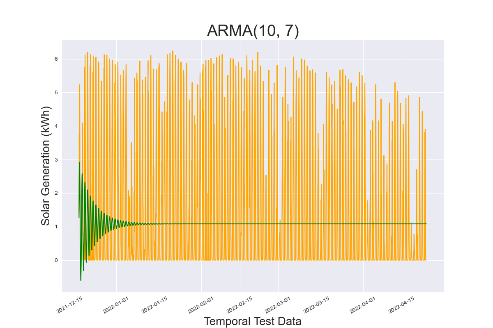
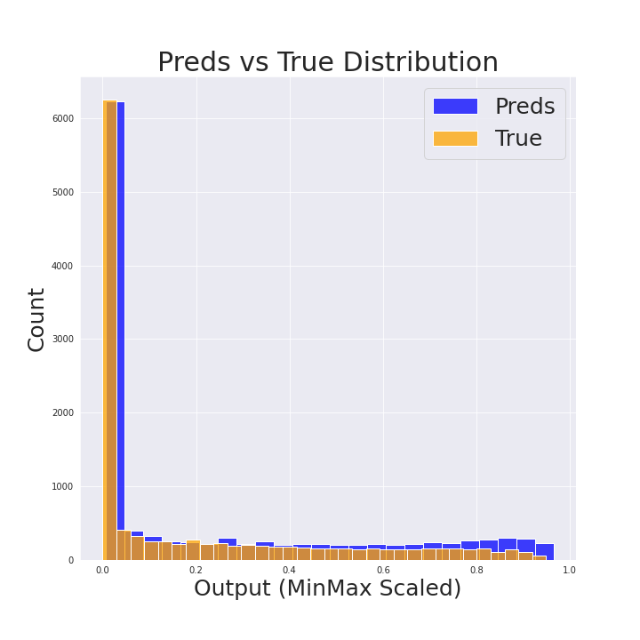

# Solar Energy Generation Prediction

## Table of Contents
* data
  * cleaned
  * raw
  * predictions
  * models
* images

* presentation
  * slides
* code
  * 01 - Data Cleaning
    * 01 - Data Cleaning

  * 02 - EDA_Preprocessing
    * 02 - EDA
    * 03 - Preprocessing

  * 03 - Modeling
    * 04 - Modeling
    * 05 - Univariate Modeling
    * 06 - Multivariate Modeling
    * 07 - Modeling Other Campuses_Sites
    * 08 - Post Modeling Analysis
    
  * 04 - Streamlit
    * solar_generation_streamlit.py
#####

---
## Background
Due to the variable nature of renewable energies (i.e., energies reliant on conditions such as cloudiness for solar or windiness for wind energy), as well as the uncertainty and variability in each renewable energy site's component architecture, predicting the power generation from each site is challenging. Consequently, the integration of solar energy generation sites with larger electrical grids can be complicated. One way of easing this burden is accurately reporting and predicting power generation from these variable generation sites.

---
## Problem Statement
 Using the solar generation output of a specific solar farm site, along with the corresponding weather data, can a model predict the solar generation output of that specific site within a mean-absolute-error score of less than 10% of max output?

 Furthermore, can the same model architecture optimized for a specific site be used to predict the generation of another site or even another entire campus?

---
## Who This Concerns
 This investigation was carried out for research purposes and designed to be utilized in both small-scale and large-scale solar energy generation stations for optimizing operational outcomes at a site level. Moreover, accurate generation predictions are necessary for integration within the larger electric grid and help determine the amount of electricity demand renewables will provide for - allowing less waste in the electricity derived from non-renewable sources.

 Also, suppose the model for a single site can be used to predict other sites or even whole campuses. In that case, the modeling process does not need to be iterated for each location, saving time and resources.

---
## Python Libraries
Following python libraried were used during the project:
  - `pandas`
  - `numpy`
  - `seaborn`
  - `matplotlib`
  - `sklearn`
  - `sktime`
  - `statsmodel`
  - `keras`
  - `tensorflow`
  

## Notebooks
  - `Jupyter Lab`
  - `Google Colab`
  

## Models Investigated
  - `ARIMA`
  - `Univariate RNN with SimpleRNN and Dense Layers`
  - `Multivariate RNN with LTSM, SimpleRNN and Dense Layers`

---
## Datasets
For this project, a dataset was used that incorporated:
1. Solar power generation for different solar sites at different campuses at La Trobe University, Victoria, Australia. This includes photovoltaic solar energy generation data collected at 15-min intervals.
2. Weather data collected from the Australian Bureau of Meteorology (BOM). This included Apparent Temperature, Air Temperature, Dew Point Temperature, Relative Humidity, Wind Speed and Wind Direction.  
#####

---
## Data Collection
   The dataset contains high-granularity solar energy generation data from 42 solar sites across five La Trobe University, Victoria, Australia campuses. The dataset includes nearly two years of solar energy generation data collected at 15-min intervals. 
  
   The weather data in the dataset was derived from the Australian Bureau of Meteorology (BOM) using the geographical placement of each campus. The weather data includes Apparent Temperature, Air Temperature, Dew Point Temperature, Relative Humidity, Wind Speed and Wind Direction.
   > There is strong correlation between these weather features and cloud cover. Therefore, this historical weather data will have sufficiently represent the cloud cover feature that would absolutely affect solar generation output.

#####
---
## Data Cleaning
 The data provided was from 01-01-2020 at 6:45AM to 2022-04-23 at 17:15PM. This represents a timedelta of 843 days, 10 hours, and 30 min. The data was reindexed with a datetime index and separated by campus, ignoring the site location. This choice was made because longitude and latitude was recorded for each campus and the reported location of each site was reported as the larger campus location. The weather data would then match each campus, regardless of site number.  
 Next, the weather data was read in, reindexed as a datetime, and had significant missing data. It was then also split by campus number. The Solar Generation and Weather data were merged for each campus and exported.  
 To investigate the final model on a more granular scale, Campus 3 was split among its individual sites, and half the sites were exported to evaluated.

#####
---
## EDA
EDA was separated out by campus. But for each:
- the Daily Average Solar Generation across all the data was plotted to see the distribution of generation over time
- the non-zero generation data was viewed in boxplots to examine the power generation distribution
- the null values, shape, and duplicated indexes were calculated

Out of these different campuses, Campus 4 and 5's non-zero generation data was most normal and each only have one site at each campus. Randomly, Campus 5 was chosen to move forward with the modeling process.

<kbd></kbd>  

#####

<kbd></kbd>

#####

Next, the autocorrelation and partial autocorrelation plots were investigated for the 15-min frequency intervals.

#####

<kbd></kbd>

#####
The autocorrelation is very much like what was expected:
> Reflects the seasonality of night/day cycle - 48 lags (12 hours) cause the most negative score.
> 96 lags (equal to 1 day) is very highly correlated, but not quite 1
>> This is most likely due to differences in the weather
##### 

<kbd></kbd>  

#####

The partial autocorrelation shows the most important is the 15-min interval before the one in question. This absolutely makes sense due to the interval frequency in relation to solar-path interval.

#####

The data was resampled for hourly and the autocorrelation and partial autocorrelation plots were investigated:

#####

<kbd></kbd>

#####

<kbd></kbd>

#####

The autocorrelation and partial autocorrelation plots demonstrate the same things as the 15-min interval plots. However, the hourly partial autocorrelation also shows more importance in 2 lags as well as 21, 22, and 23 lags. 

Finally, four of eight sites at Campus 3 were examined and exported to determine if the Campus5 model can be applied more granularly at the site level. Specifically, Site 10 seems to have the most similar daily average plot as well as the same scale as Campus 5. Thus, Site 10 is the most likely site to be well modeled by the Campus 5 best model.

#####

<kbd></kbd>

#####

---
## Data Preprocessing and Targeted EDA

By examining the Solar Generation across the time span given, Campus 5 clearly shows broad seasonality (i.e., the astronomical seasons - southern hemisphere's winter peaking around July and summer peaking around January) as well as daily seasonality (i.e., the daily solar cycle - day/night): the latter seasonality shown by the autocorrelation plots above.

However, the variability in the data is quite extreme from day-to-day. For instance, the plots of the first day and the eleventh day is provided below:

#####

<kbd></kbd>

#####

<kbd></kbd>

#####

The dramatic change in output on Day 1 more than like is a result of electrical architecture failings, and not weather. A cloudy day can reduce solar generation by up to 90%, but the extreme change in such a little time period more than likely means a failure in the inverter / connectivity issue. This presents variability the model will inherently struggle with.

Using the last value in the train sequence, the baseline predictions were simply that value applied to the entire testing daterange.

#####

<kbd></kbd>

#####

| Testing MAE |  Testing RMSE  |
| :---------: | :------------: |
|    1.141    |      2.447     |

#####

After hourly resampling the data, the Augmented Dickey Fuller test was employed to check the stationarity of the data. With a p-value goal of less than 0.01, the non-differenced data passed with an extremely low p-value. Therefore, the *d* parameter of an ARIMA model will be zero.

----
## Modeling

### ARIMA Modeling

Initially, gridsearching ARIMA modeling was used on hourly-resampled data to try to get the best *p* and *q* hyperparameters (d was already established to be 0).

After running the ranged gridsearch, the best arima model was shown to be a ARIMA(10, 0, 7) model with an Akaike score of 38.0, which was excellent considering most ARIMA models were three orders of magnitude larger.

#####

<kbd></kbd>

#####

However, once plotted, this ARIMA model basically sinusoidally represents the daily seasonability with very low variance accounted for:

#####

<kbd></kbd>

#####  

<kbd></kbd>

#####

This resulted in MAE and RMSE scores of:

| Testing MAE |  Testing RMSE  |
| :---------: | :------------: |
|    1.524    |      1.934     |

#####

### Lagged Modeling

Next, the lagged models of both the 15-min frequency data and the hourly sampled data were investigated. The number of lags were based on the partial autocorrelation determined in the EDA.

The 15-Min Freq Data:

#####

<kbd></kbd>

#####

Most of the preds look like the true values shifted over by 15 minutes. However, looking closely, especially at the second hundred intervals graphed (specifically around 9am on 11-10), the predictions and true values diverge briefly. This means the predictions aren't just relying on the first lagged value, even though that is the most utilitzed variable. The linear regression's coefficients proved this.

Lagged Linear Regression Scores

| Training R-Squared |  Testing R-Squared  |
| :----------------: | :-----------------: |
|       0.875        |        0.899        |

This shows the most informative lags still only account for 89.9% of the variability in the data. Therefore, things like the weather still play an important role in the variability.

Lagged Prediction Scores:

| Testing MAE |  Testing RMSE  |
| :---------: | :------------: |
|    0.260    |      0.629     |

These results demonstrates that a model that is updated every 15-min can predict the next 15-min interval with the above scores. However, modeling in that way would be very difficult to maintain. Thus, the RNN modeling's goal is to beat these scores.

### Recurrent Neural Network Modeling

 Using Google Colab, both Univariate and Multivariate modeling was investigated on the 15-min interval data, the resampled hourly data, and the resampled daily max data.

<u> Univariate Modeling:  </u>  
Exploring different combination of SimpleRNN and Dense layers, along with experiementing on different sequence lengths the two best models were found (best for MAE and best for RMSE).  

 Next, the best two models then had their Adam Optimizer's learning rate tuned to get the final, best model:

Best Model:
- 16 interval sequences (4 Hours)
- Two SimpleRNN layer with 32 nodes each
- Dense output layer (linear activation for Regression)
- Adam Learning Rate of 0.0008

| Testing MAE |  Testing RMSE  |
| :---------: | :------------: |
|    0.1871   |     0.5765     |

<u> Multivariate Modeling:  </u>  

The weather data was incomplete compared to the solar generation data and was not included for the first year (approximately). So the dataframe was curtailed to where the weather data starts (index 33311). The weather was then interpolated using feed-forward methods, allowing for no missing data.

Next, the features were selected and scaled. Finally, the timeseries sequences were examined for 4 intervals (1 hour), 16 intervals (4 hours), and 96 intervals (1 day) and subsequently run through a variety of models, including LSTM, SimpleRNN and Dense layers.

The best model (4-hour sequences with LSTM and 96 nodes) gave results of:

| Testing MAE |  Testing RMSE  |
| :---------: | :------------: |
|   0.4346    |     0.8450     |

These scores are not nearly as optimal as those found through univartiate modeling. Thus, the top univariate model will be used when investigating its application to entire campuses with many sites and to more granular, single sites within the larger campuses.

<u> Applying Best Models to Other Campuses and Sites:  </u>

Each of the other campuses (Campus 1-4) and four sites from Campus 3 (Sites 6, 8, 10, and 12) were Min/Max Scaled and then used to train and test the best model (and its respective sequence length) and the results are below:

#####

<kbd></kbd>

#####

When compared to the results from Campus 5, the Min/Max Scaled data returns very similar MAE and RMSE scores for each campus/site. These results allow the best model found for Campus 5 to potentially be used across different sites and campuses to predict the solar generation output.

     
### Post Modeling Analysis:
#####

#### Campus 5:

#####
<kbd></kbd>

#####

The distribution of Campus 5's best model predictions versus the true test values reveals the predictions to regularly be slightly higher than the true values. This is further shown by the first and last day of the testing data and the corresponding predictions:

#####

<kbd></kbd>
<kbd></kbd>

#####

Campus 1 also shows this trend:

#####

<kbd></kbd>

#####

This trend is shown in Site 10 at lower values, but it seems the predictions have a lower maximum than the true values:

#####

<kbd></kbd>

#####

Interestingly enough, by simply subtracting the value each model predicts over night (where the actual values are 0), the resulting "Preds Minus" does even better in MAE and RMSE scores:

| Campus/Site |  Preds MAE  |  Preds Minus MAE  |   Preds RMSE   |   Preds Minus RMSE   |
| :---------: | :---------: | :---------------: | :------------: | :------------------: |
|   Campus 5  |   0.0571    |      0.0406       |     0.0757     |        0.0642        |
|   Campus 1  |   0.0458    |      0.0383       |     0.0651     |        0.0601        |
|   Site 10   |   0.0468    |      0.0399       |     0.0692     |        0.0653        |

This simple subtraction method seems to be working well and is absolutely worth investigating for each Site/Campus to get even better predictions.

----
## Conclusion & Recommendation

Based on the wide variety of analyses and modeling conducted, the best model could predict the solar generation output with an MAE score of less than 10% of the maximum solar generation output (0.6 kWh in the case of Campus 5).   

Moreover, the best model's architecture does reasonably well when applied to the other Campuses and the specific Sites examined (the MAE and RMSE scores of the Min/Max Scaled data were less than the target of approximately 0.1 - or 10% of max output).   

However, the variability in the output relies on many things, such as the component's functionality and weather patterns. Consequently, collecting and examining cloud cover data is recommended for future research on the that feature's effect on energy generation at these sites.

----

## Future Research

For future investigations, the model could potentially be better at predicting the exact output at each Campus or at each site by incorporating:
     
- Accurate Sunrise and Sunset feature
- Weather data specifically concerning cloud cover
- Using different models on each Campus and Site to determine if different models to better at different sites or at different levels (Entire Campus vs Individual Site)
- Maintenance schedules or reports of electrical architecture malfunction

----

## Data Dictionary

| Features                | Data Types | Description         |
| :---------------------- | :--------- | :--------------- |
| Campus Key              | Int    | Campus ID Key     |
| Site Key          | Int    | Site ID Key     |
| Timestamp            | datetime    | datetime of the observation     |
| SolarGeneration       | float64    | The kWh generated     |
| ApparentTemperature              | float64    | Apparent Temp (degrees C)              |
| AirTemperature          | float64    | Air Temp (degrees C)        |
| DewPointTemperature            | float64    | Dew Point Temp (degrees C)           |
| RelativeHumidity          | float64    | Humidity Percentage         |
| WindSpeed             | float64    | Windspeed (m/s)                    |
| WindDirection        | float64    | Wind Direction (degrees from North)           |
